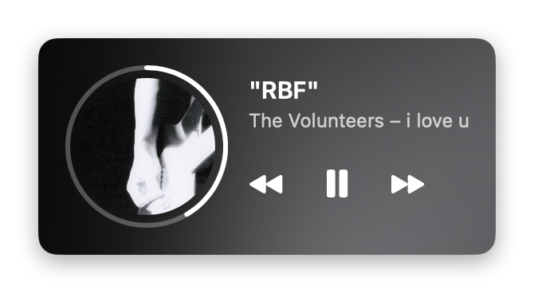
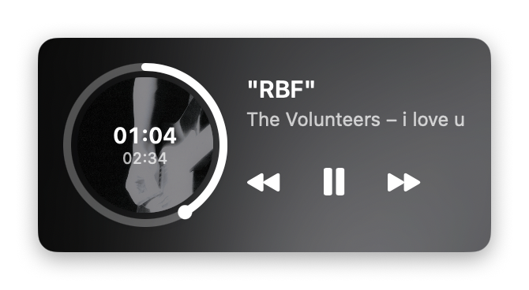
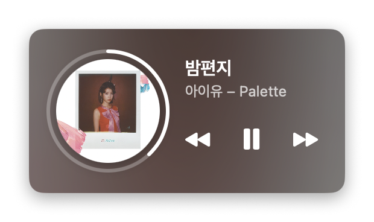
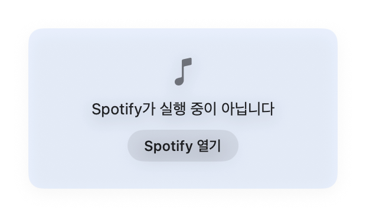
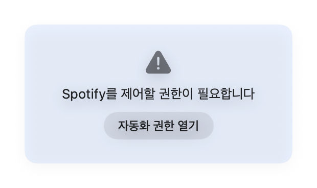

# Spotify MenuBar

macOS 메뉴바에서 현재 Spotify에서 재생 중인 곡 정보를 실시간으로 확인하고 제어할 수 있는 미니 플레이어 앱입니다.



## 개요

Spotify 데스크톱 앱은 기본적으로 macOS 메뉴바 표시 기능을 제공하지 않습니다. 재생 중인 곡을 확인하려면 작업 중 매번 Spotify 창을 전면으로 불러와야 하는 번거로움이 있습니다.

`Spotify MenuBar`는 메뉴바에 `곡 제목 - 아티스트` 형태로 핵심 정보만 최소한으로 노출하여 작업 흐름을 방해하지 않고 플레이어를 제어할 수 있도록 제작되었습니다.

## 주요 기능

* **메뉴바 실시간 정보 표시**: 재생 중인 곡 정보가 `곡 제목 - 아티스트` 형식으로 메뉴바에 표시됩니다. 일시정지 상태에서는 텍스트 톤이 흐려져 재생 상태를 직관적으로 파악할 수 있습니다.
* **텍스트 길이 조절**: 기본 40자 제한이며, 제목이 길 경우 잘림 처리됩니다. (설정에서 길이 변경 가능)
* **미니 플레이어**: 메뉴바 텍스트 클릭 시 조작 창이 열립니다.
    * 이전 곡 / 다음 곡 이동, 재생 / 일시정지 제어
    * 곡 제목 클릭 시 Spotify 데스크톱 앱에서 해당 곡으로 바로 이동
* **진행 상태 링 & 호버 정보**: 앨범 커버를 둘러싼 링으로 재생 진행 상황을 나타냅니다.
    * 링을 드래그하여 원하는 재생 시점으로 이동 가능
    * 마우스 호버 시 현재 재생 시간 및 총 곡 길이가 앨범 커버 위에 표시됨
* **동적 배경색 & 가변 창 너비**: 앨범 커버에서 추출한 주요 색상을 배경에 반영합니다. 곡 제목 길이에 맞춰 창 너비가 동적으로 조절되므로 여백이 불필요하게 남지 않습니다.
* **컨텍스트 메뉴 (우클릭)**:
    * Spotify 앱 열기
    * 메뉴바 표시 글자 수 변경 (20 / 30 / 40 / 60자)
    * 로그인 시 자동 실행 설정
    * 앱 종료

## 화면

| 링 호버 (재생 시점 표시) | 일시정지 상태 |
| :---: | :---: |
|  |  |
| **앨범별 배경색 및 가변 너비** | **재생 중인 곡이 없을 때** |
|  |  |

## 요구 사항

* macOS 13 (Ventura) 이상
* Spotify 데스크톱 앱

## 설치 방법

### 1. Pre-built 바이너리 다운로드 (.dmg)

1. [Releases 페이지](https://github.com/OseungKwon/spotify-menubar/releases/latest)에서 최신 `.dmg` 파일을 다운로드합니다.
2. `.dmg` 파일을 열고 앱을 `Applications` 폴더로 끌어다 놓습니다.

> **보안 경고 안내 ("확인할 수 없는 개발자")**
> 정식 개발자 서명 없이 배포된 앱 실행 시 macOS 보안 경고가 발생할 수 있습니다.
> **시스템 설정 → 개인정보 보호 및 보안**의 하단 보안 섹션에서 **[확인 없이 열기]**를 클릭하여 1회 승인 후 실행해 주세요.

---

### 2. 소스코드 빌드 및 설치

[Xcode Command Line Tools](https://developer.apple.com/download/all/)가 설치되어 있어야 합니다. 터미널에서 아래 명령어를 실행합니다.

```bash
git clone https://github.com/OseungKwon/spotify-menubar.git
cd spotify-menubar
make install
```

빌드가 완료되면 앱이 `응용 프로그램` 폴더에 자동으로 설치 및 실행됩니다. (직접 빌드한 앱은 보안 경고가 발생하지 않습니다.)

---

### 최초 실행 시 권한 승인

설치 방식에 상관없이 최초 실행 시 **"SpotifyMenuBar에서 Spotify을(를) 제어하도록 허용하시겠습니까?"** 권한 요청 창이 팝업됩니다.

곡 정보를 정상적으로 읽어오기 위해 **허용**을 선택해야 합니다. 실수로 거부한 경우 메뉴바에 `권한 필요` 안내가 표시되며, 해당 문구를 클릭하여 macOS 시스템 설정에서 권한을 다시 부여할 수 있습니다.



## 제약 및 참고 사항

* **Spotify 데스크톱 앱 전용**: 웹 플레이어(Web Player)나 모바일 기기에서 재생 중인 곡 정보는 가져오지 못합니다. 정보가 표시되지 않을 경우 데스크톱 앱에서 재생 중인지 확인해 주세요.
* **미지원 기능**: 좋아요 등록 여부, 가사 보기, 재생 대기열 조회는 지원하지 않습니다. 해당 정보는 AppleScript로 제공되지 않으며 Spotify Web API 연동이 필요합니다.
* 앱을 다시 빌드하거나 업데이트할 경우 권한 승인 요청이 다시 나타날 수 있습니다.

## 개발 및 빌드 명령어

Makefile을 통해 다음 동작을 수행할 수 있습니다.

```bash
make build     # .app 번들 빌드
make run       # 빌드 후 실행
make install   # 응용 프로그램 폴더에 설치 후 실행
make dmg       # 배포용 .dmg 생성 (universal binary)
make clean     # 빌드 아티팩트 정리
```
